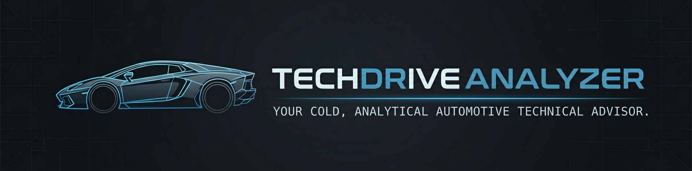
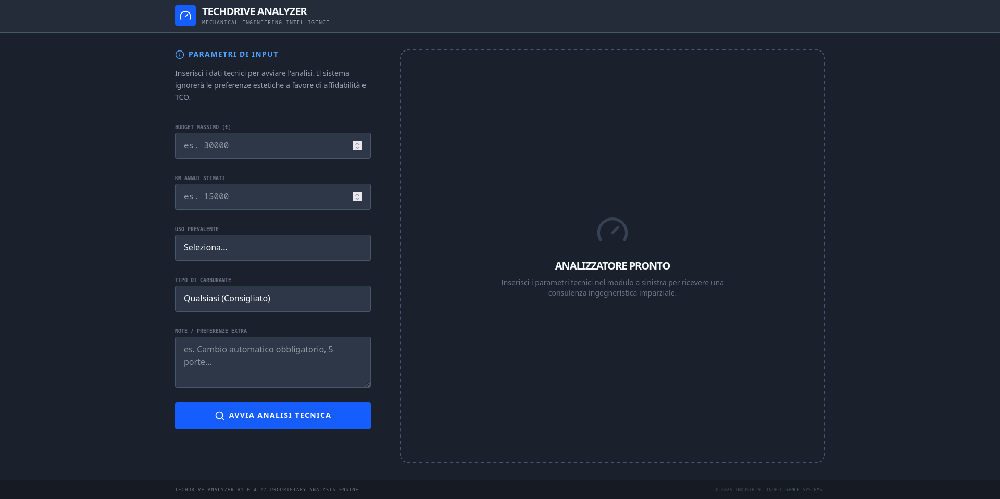

<div align="center">

</div>

# TechDrive Analyzer 🏎️⚙️

**TechDrive Analyzer** is a professional, data-driven car recommendation engine. Unlike traditional car search tools, this application acts as a cold, analytical mechanical engineer that prioritizes reliability, Total Cost of Ownership (TCO), and mechanical integrity over marketing hype.

## 🛠️ The Engineering Philosophy

The core logic is powered by a custom-tuned Gemini AI model that adopts a specific persona:
- **Cold & Analytical**: No emotional bias towards brands.
- **Data-First**: Focuses on power-to-weight ratios, torque curves, and residual value.
- **Honest**: Explicitly highlights known mechanical flaws and common points of failure.
- **Anti-Marketing**: Disregards aesthetic trends in favor of long-term durability.

## ✨ Key Features

- **2x2 Engineering Grid**: A clean, distraction-free layout that presents 4 technical recommendations simultaneously.
- **TCO (Total Cost of Ownership)**: Estimated monthly costs including maintenance, fuel, and depreciation.
- **Mechanical Deep-Dive**: Analysis of engine and transmission reliability.
- **Critical Weakness Alerts**: Every recommendation includes a "Critical Weakness" warning based on historical data.
- **Full-Screen Industrial UI**: A high-density, dark-themed interface designed for focused technical analysis.

<div align="center">

</div>

## 🚀 Tech Stack

- **Frontend**: React 18 + Vite
- **Styling**: Tailwind CSS (Industrial Theme)
- **AI Engine**: Google Gemini API (`gemini-3-flash-preview`)
- **Animations**: Framer Motion
- **Icons**: Lucide React
- **Type Safety**: TypeScript

## 📦 Getting Started

### Prerequisites

- Node.js (v18 or higher)
- A Google Gemini API Key

### Installation

1. Clone the repository:
   ```bash
   git clone https://github.com/your-username/techdrive-analyzer.git
   cd techdrive-analyzer
   ```

2. Install dependencies:
   ```bash
   npm install
   ```

3. Configure environment variables:
   Create a `.env` file in the root directory:
   ```env
   GEMINI_API_KEY=your_api_key_here
   ```

4. Start the development server:
   ```bash
   npm run dev
   ```

## 📊 Data Structure

The analyzer evaluates cars based on:
- **Reliability Score**: 1-10 scale based on engine/electronics history.
- **Depreciation (5y)**: Estimated percentage of value lost over 5 years.
- **Monthly TCO**: Real-world cost estimation including maintenance.
- **Segment Analysis**: Categorization by chassis type and intended use.

## ⚖️ Disclaimer

*TechDrive Analyzer provides technical estimates based on market data and AI analysis. Mechanical reliability can vary based on individual maintenance history. Always perform a professional pre-purchase inspection (PPI) before acquiring a vehicle.*

---
**TechDrive Analyzer** // *Mechanical Engineering Intelligence*
